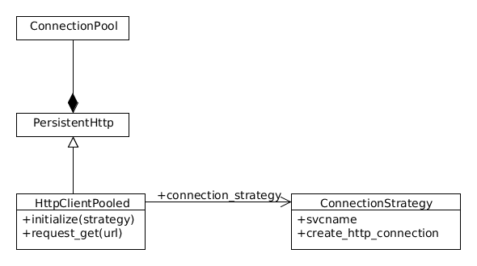

zk-http
=======

## What is it

It combines [persistent\_http](https://github.com/bpardee/persistent_http) and zk-service-registry into an easy to use http client library (it's Net:HTTP acutally) which includes http connection pooling and service name resolution via Zookeeper.

## How it works

Here is an UML diagramm to give you an overview

HttpClientPooled inherits the connection pooling capabilities from PersistentHttp but overrides the connection factory mechanism in the constructor. The connection factory logic is encapsulated in a strategy class which handles all service name resolution and Zookeeper stuff. A strategy class must support a svcname property which returns the service name to be resolved and a create\_http\_connection factory method that must return an instance of Net::HTTP

## Examples

 
